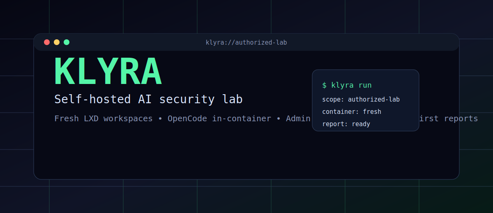
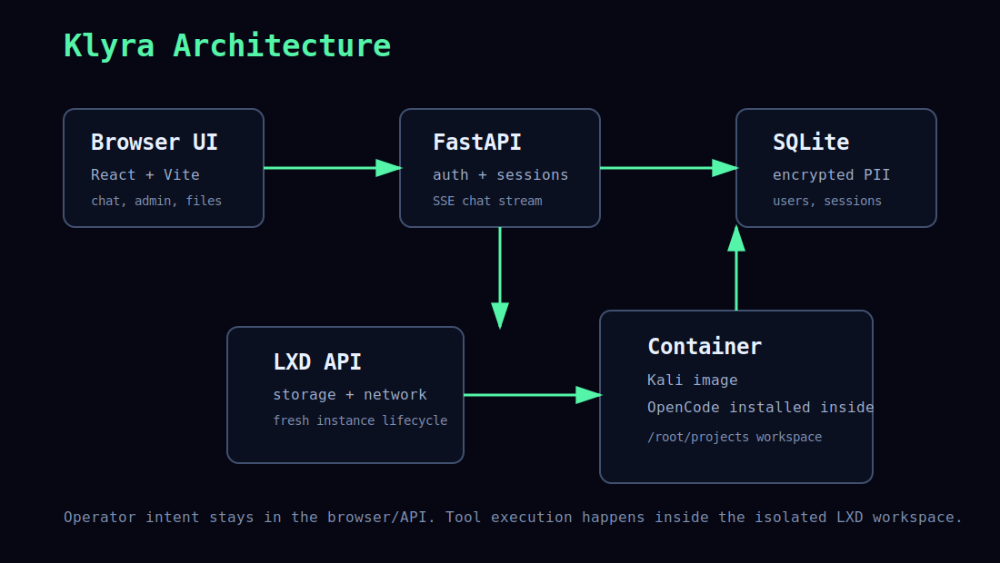

<p align="center">
  
</p>

<p align="center">
  <a href="LICENSE"></a>
  
  
  
  
</p>

# Klyra

Klyra is a self-hosted AI security lab for authorized testing. It gives each operator a fresh LXD workspace, runs OpenCode inside that isolated container, and wraps the workflow in a browser UI with chat, files, sessions, admin controls, and clean findings.

> Built for owned labs, internal appsec, CTFs, security education, and written-scope assessments. Do not use Klyra against systems you do not own or have explicit permission to test.

## Why It Stands Out

- **Fresh workspace on demand**: user sessions are backed by LXD containers, not your host shell.
- **OpenCode inside the container**: no host binary leakage, no accidental local history reuse.
- **Admin dashboard**: create users, promote access, inspect containers, stop/delete workspaces.
- **Evidence-first chat**: streaming responses, command outputs, session records, and project files.
- **Public-safe agent policy**: the bundled agent policy is scoped to authorized testing and remediation.
- **One-command demo deploy**: Python dependencies, frontend build, LXD checks, backend start, and Cloudflare quick tunnel.

## Architecture

<p align="center">
  
</p>

## Quick Start

Requirements:

- Ubuntu/Debian VPS or local Linux host
- Python 3.12+
- Node.js 18+
- LXD
- `cloudflared` optional for public demo tunnels

```bash
git clone https://github.com/CodexNexor/klyra.git
cd klyra
python3 deploy/run.py
```

The deploy script prints the local URL, optional public tunnel URL, and owner credentials. For production, set strong credentials before running:

```bash
export OWNER_USERNAME="owner"
export OWNER_PASSWORD="$(openssl rand -base64 32)"
export DB_MASTER_KEY="$(openssl rand -hex 32)"
python3 deploy/run.py
```

## Common Commands

```bash
# Normal clean app start
python3 deploy/run.py

# Remove Klyra runtime state and app containers before deploy
python3 deploy/run.py --nuke

# Reinstall LXD from scratch, then deploy
python3 deploy/run.py --nuke-lxd

# LXD isolation smoke test
python3 isolation.py selftest

# Frontend build
cd frontend && npm install && npm run build
```

## Admin Flow

1. Log in as the owner printed by `deploy/run.py`.
2. Open `/admin`.
3. Create a pro user or promote an existing user.
4. Open `/playground`.
5. Klyra provisions a fresh LXD container for that user and starts the chat workspace.

## Security Model

Klyra is a lab boundary, not a magic trust boundary.

- The host runs the API, database, frontend, and LXD daemon.
- The operator workspace runs in an unprivileged LXD container.
- OpenCode is installed inside the container during provisioning.
- Session metadata is stored in SQLite; sensitive fields use application-level encryption.
- The bundled `OPENCODE.md` instructs agents to stay within authorized testing and avoid malware, credential theft, persistence, evasion, destructive actions, and unauthorized access.

Read [SECURITY.md](SECURITY.md) before exposing an instance.

## Launch Checklist

- [ ] Set `OWNER_PASSWORD` and `DB_MASTER_KEY`.
- [ ] Enable host firewall rules.
- [ ] Restrict admin access to trusted operators.
- [ ] Use named Cloudflare tunnels or your own reverse proxy for production.
- [ ] Review `OPENCODE.md` for your organization’s policy.
- [ ] Configure log retention and backup policy.
- [ ] Test `python3 isolation.py selftest`.

## Repository Topics

Suggested GitHub topics:

`ai-security`, `appsec`, `pentest-lab`, `lxd`, `fastapi`, `react`, `opencode`, `security-automation`, `ctf`, `authorized-testing`

## Inspiration Notes

Popular AI-security repos in this space win attention with a short name, immediate screenshot/diagram, badges, a one-command demo, clear scope, and a strong safety/legal boundary. Klyra follows that launch shape while keeping the repo self-hosted and public-safe.

## License

MIT. See [LICENSE](LICENSE).
